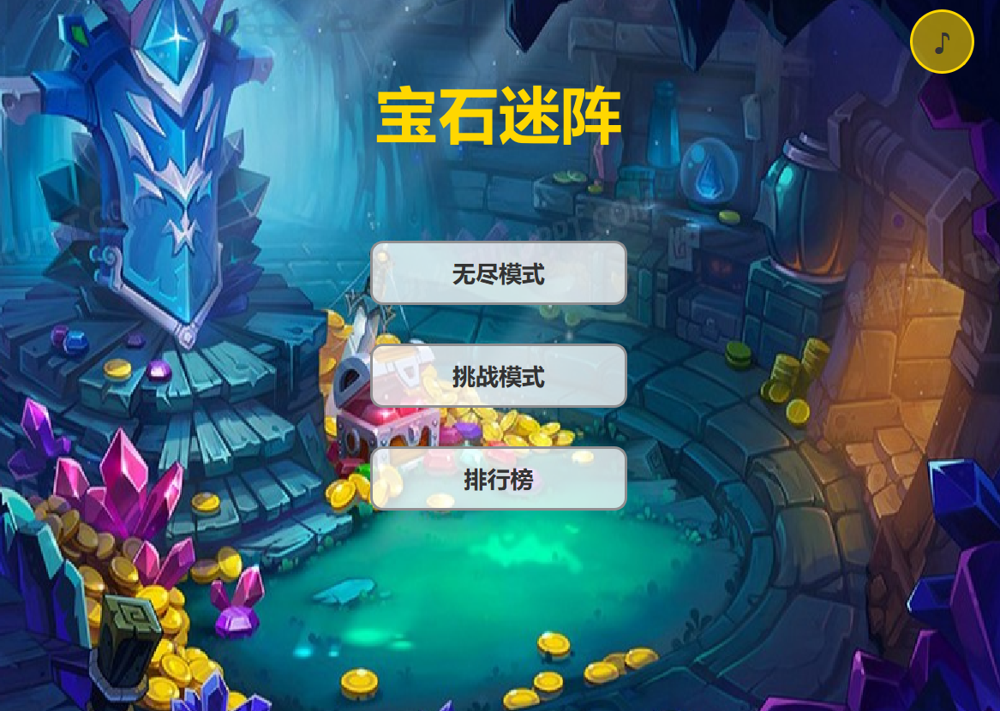
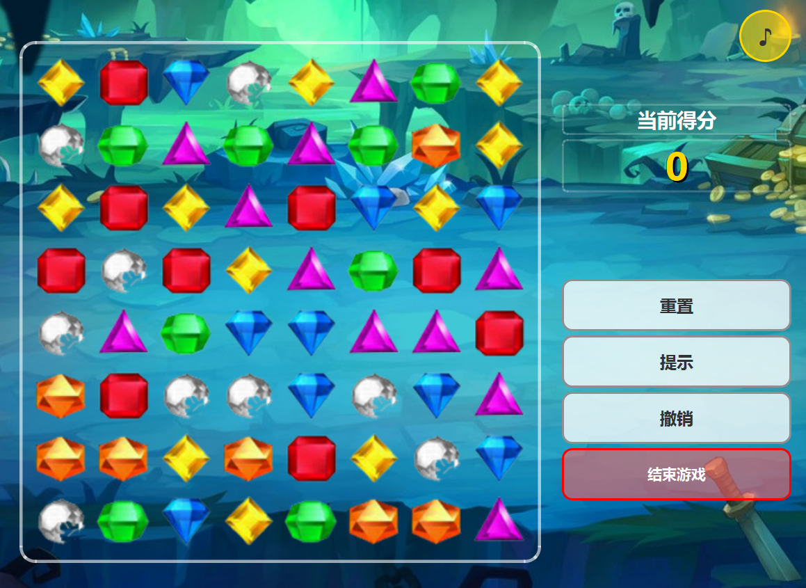

# 宝石迷阵游戏 (BejeweledGame)

## 项目简介

宝石迷阵是一款经典的消除类游戏，玩家需要交换相邻的宝石，形成三个或三个以上相同颜色的宝石连线，从而消除它们并获得分数。本项目使用Qt框架开发，实现了基础的游戏功能和界面。

## 项目结构

```
BejeweledGame/
├── assets/                 # 资源文件
│   ├── images/            # 图片资源
│   │   ├── blue.png       # 蓝色宝石
│   │   ├── game_bg.jpg    # 游戏背景
│   │   ├── green.png      # 绿色宝石
│   │   ├── menu_bg.jpg    # 菜单背景
│   │   ├── orange.png     # 橙色宝石
│   │   ├── purple.png     # 紫色宝石
│   │   ├── rank_bg.jpg    # 排行榜背景
│   │   ├── red.png        # 红色宝石
│   │   ├── white.png      # 白色宝石
│   │   └── yellow.png     # 黄色宝石
├── build/                 # 构建输出目录
│   ├── bin/               # 可执行文件目录
│   │   ├── datas/         # 排行榜数据文件
│   │   │   ├── challenge_ranking.txt  # 挑战模式排行榜
│   │   │   └── endless_ranking.txt    # 无尽模式排行榜
│   ├── debug/             # 调试版本构建文件
│   └── release/           # 发布版本构建文件
├── screenshots/           # 游戏截图
│   ├── game.png           # 游戏主界面截图
│   └── menu.png           # 游戏菜单截图
├── src/                   # 源代码
│   ├── model/             # 游戏逻辑模型
│   │   ├── Const.h        # 常量定义
│   │   ├── GameMap.cpp    # 游戏地图实现
│   │   ├── GameMap.h      # 游戏地图头文件
│   │   └── Gem.h          # 宝石类定义
│   └── view/              # 游戏界面视图
│       ├── GameWidget.cpp # 游戏主界面实现
│       ├── GameWidget.h   # 游戏主界面头文件
│       ├── GameWidget.ui  # 游戏主界面UI设计
│       ├── MenuWidget.cpp # 菜单界面实现
│       ├── MenuWidget.h   # 菜单界面头文件
│       ├── MenuWidget.ui  # 菜单界面UI设计
│       ├── RankingWidget.cpp # 排行榜界面实现
│       ├── RankingWidget.h   # 排行榜界面头文件
│       └── RankingWidget.ui  # 排行榜界面UI设计
├── BejeweledGame.pro      # Qt项目配置文件
└── resources.qrc          # Qt资源文件配置
```

## 技术栈

- **开发框架**: Qt 5+
- **编程语言**: C++11
- **构建工具**: qmake
- **UI设计**: Qt Designer (.ui文件)
- **资源管理**: Qt Resource System (.qrc)

## 功能说明

1. **游戏模式**:
   - 无尽模式: 无时间限制，持续消除宝石获得高分
   - 挑战模式: 完成特定目标，解锁新的关卡

2. **核心功能**:
   - 宝石交换与消除
   - 连锁反应计算
   - 分数统计
   - 排行榜系统

## 构建和运行

1. 使用Qt Creator打开 `BejeweledGame.pro` 文件
2. 选择构建配置 (Debug/Release)
3. 构建项目
4. 运行生成的可执行文件

## 游戏截图

### 游戏菜单界面


### 游戏主界面


## 项目总结

本项目实现了一个基础版的宝石迷阵游戏，包含了核心的游戏逻辑和友好的用户界面。通过使用Qt框架，实现了游戏逻辑与界面的分离，提高了代码的可维护性。游戏支持两种游戏模式和排行榜功能，为玩家提供了完整的游戏体验。